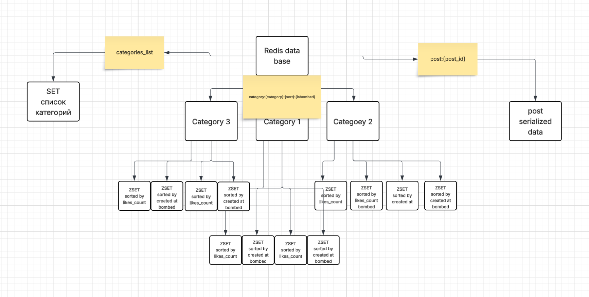

# Burn-after

### 📝 About the repository

This project started as a playground for Django REST Framework and caching experiments.  
> It's not a perfect codebase, but...

- You can clone it and try out how caching works in practice.
- Explore how the project is structured.
- Use the existing endpoints to test different query param behavior.

---

## 🚀 Main Endpoint

Get filtered list of posts:

```http
GET /api/v1/posts/?category=environment&page=1&is_exploded=false&sort=likes
````

Query Parameters:

* `category`: filter by category
* `page`: pagination (integer)
* `is_exploded`: boolean flag
* `sort`: sorting method (created_at, -created_at, likes, -likes)

---

## 🧠 Caching Scheme



The caching layer is used to store pre-rendered responses based on query params.
Cache keys are built dynamically from URL parameters.

---

## 📁 Project Structure 

```text
burnafter/
├── posts/
│   ├── views.py
│   ├── serializers.py
│   ├── urls.py
│   ├── views.py
│   ├── models.py
│   └── cache
│       ├── categories.py
│       ├── posts.py
│       └── zsets.py
├── manage.py
```

